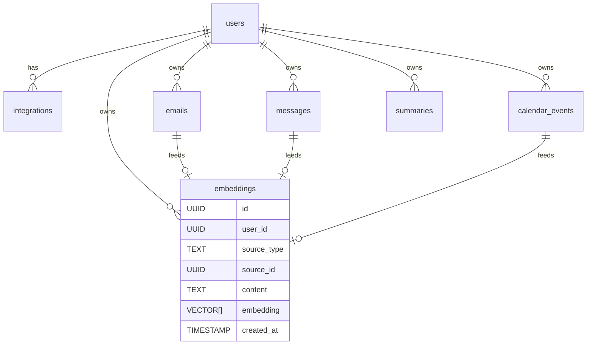

# Agent Swarm

[](https://opensource.org/licenses/MIT)
[](https://nodejs.org/)
[](https://www.typescriptlang.org/)
[](https://bun.sh/)

A powerful AI Agent Swarm application built with TypeScript and Hono, featuring intelligent agent routing using the AgentSwarm framework, MCP (Model Context Protocol) tool integration, Google OAuth authentication, and unified output strategies for seamless AI interaction.

## 🚀 Features

- **🤖 AgentSwarm Integration**: Built on the AgentSwarm framework with Hive/Swarm architecture
- **👑 Queen Agent Pattern**: Business logic agent that routes to specialized worker agents
- **🔌 MCP Tool Integration**: Extensible Model Context Protocol support for external services
- **🔐 Google OAuth Authentication**: Secure authentication with Google account integration and Gmail API access
- **🌐 RESTful API Server**: User-based API with streaming and non-streaming endpoints, built with Hono
- **📚 Message History**: Persistent conversation history per authenticated user with tool call tracking
- **🎯 Unified Output Strategies**: Strategy pattern supporting SSE streaming and collected outputs
- **⚡ Real-time Streaming**: Live AI response streaming with Server-Sent Events
- **⏳ Temporal Workflows**: Robust, scalable, and reliable workflow and activity management for asynchronous tasks.
- **🍽️ Restaurant Booking**: Built-in restaurant search and booking capabilities
- **📊 Interactive Web Interface**: Built-in web interface for easy testing and interaction
- **🔧 TypeScript**: Full type safety and modern development experience
- **📈 Extensible Architecture**: Easy to add new agents and MCP tools
- **⚙️ Configuration-Driven**: NEW! Declarative agent setup - add agents without code changes
- **🛡️ Auto-Validation**: NEW! Comprehensive configuration validation with detailed error messages
- **🔄 Smart Routing**: NEW! Automatic handover tool generation based on keywords

## 🚀 Getting Started

To get the Agent Swarm running locally, follow these steps.

### Prerequisites

- Node.js v20 or higher
- Bun package manager
- Docker and Docker Compose
- Anthropic API key
- Google Cloud Console project with OAuth 2.0 credentials

### 1. Installation

**Clone the repository**:

```bash
git clone https://github.com/samwang0723/agent-swarm.git
cd agent-swarm
```

**Install dependencies**:

```bash
bun install
# or using make
make install
```

### 2. Configuration

**Set up environment variables**:

Create a `.env` file by copying the example and filling in your credentials. Then, update the `.env` file with your configuration.

```bash
cp .env.example .env
```

**Set up Google OAuth**:

- Create a project in [Google Cloud Console](https://console.cloud.google.com/)
- Enable the Gmail API and Google+ API
- Create OAuth 2.0 credentials (Client ID and Client Secret)
- Add authorized redirect URIs: `http://localhost:3000/api/v1/auth/google/callback`

### 3. Running the Application

**Start Infrastructure Services**:

This command starts the PostgreSQL database, Temporal, and other required services defined in `docker-compose.yml`.

```bash
make docker-build-worker

cd src/shared/infrastructure
docker-compose up -d
cd ../../.. # Return to the root directory
```

**Start the Development Server**:

This serves the API and the web interface. The application also starts the Temporal worker to listen for tasks.

```bash
bun run dev
# or
make dev
```

The server will start on `http://localhost:3000` with:

- **Web Interface**: `http://localhost:3000` - Interactive chat interface
- **API Documentation**: `http://localhost:3000/api/v1/docs` - API documentation
- **Authentication**: `http://localhost:3000/api/v1/auth/google` - Google OAuth login
- **Temporal UI**: `http://localhost:8233` - Temporal Web UI

### Authentication Flow

1. **Navigate to Google Auth**: `GET /api/v1/auth/google`
2. **Complete OAuth Flow**: Redirected to Google for consent
3. **Receive Session Token**: Callback provides session token
4. **Use APIs**: Include token in Authorization header or as cookie

### HTTP API Server

#### Authentication Endpoints

**GET /api/v1/auth/google**

- Initiate Google OAuth authentication
- Redirects to Google consent screen

**GET /api/v1/auth/google/callback**

- Handle Google OAuth callback
- Returns session token and user information

#### Chat Endpoints (Require Authentication)

**POST /api/v1/chat/init**

- Initializes the chat swarm for the user session to enable faster first responses.
- Headers: `Authorization: Bearer <token>` or session cookie
- Response: `{ "success": true, "message": "Swarm initialized" }`

**POST /api/v1/chat/stream**

- Streaming chat endpoint with Server-Sent Events (SSE).
- Headers: `Authorization: Bearer <token>` or session cookie
- Request body: `{ "message": "your message" }`
- Response: SSE stream with real-time AI responses.

**POST /api/v1/chat**

- Non-streaming chat endpoint.
- Headers: `Authorization: Bearer <token>` or session cookie
- Request body: `{ "message": "your message" }`
- Response: `{ "response": "complete AI response", "userId": "string" }`

**GET /api/v1/chat/history**

- Get chat history for the authenticated user.
- Headers: `Authorization: Bearer <token>` or session cookie
- Response: `{ "userId": "string", "messageCount": number, "messages": [...] }`

**DELETE /api/v1/chat/history**

- Clear chat history for the authenticated user.
- Headers: `Authorization: Bearer <token>` or session cookie
- Response: `{ "message": "History cleared", "userId": "string" }`

**GET /api/v1/chat/models**

- Get information about the current and available AI models.
- Headers: `Authorization: Bearer <token>` or session cookie
- Response: `{ "current": { ... }, "available": [ ... ] }`

#### System Endpoints

**GET /api/v1/health**

- Health check endpoint with MCP server status
- Response: `{ "status": "ok", "timestamp": "ISO-date", "mcp": {...}, "tools": {...} }`

### Example API Usage

```bash
# 1. Authenticate with Google (opens browser)
curl http://localhost:3000/api/v1/auth/google

# 2. Use the session token from callback in subsequent requests
TOKEN="your_session_token_here"

# Streaming chat
curl -X POST http://localhost:3000/api/v1/chat/stream \
  -H "Authorization: Bearer $TOKEN" \
  -H "Content-Type: application/json" \
  -d '{"message": "Find me a romantic restaurant for a date tonight in Taipei"}'

# Non-streaming chat
curl -X POST http://localhost:3000/api/v1/chat \
  -H "Authorization: Bearer $TOKEN" \
  -H "Content-Type: application/json" \
  -d '{"message": "Hello, Claude!"}'

# Get chat history
curl -H "Authorization: Bearer $TOKEN" \
  http://localhost:3000/api/v1/chat/history

# Clear chat history
curl -X DELETE -H "Authorization: Bearer $TOKEN" \
  http://localhost:3000/api/v1/chat/history
```

## 🤖 Agent System

### New Configuration-Driven Architecture

The Agent Swarm now uses a **modern, configuration-driven architecture** that makes agent management simple, scalable, and maintainable. The system automatically handles agent creation, routing, and tool integration based on declarative configuration.

### Key Components

- **Configuration Layer** (`src/shared/config/agents.ts`): Declarative agent definitions
- **Agent Registry** (`src/features/agents/agent.registry.ts`): Manages agent lifecycle and handover tools
- **Agent Factory** (`src/features/agents/agent.factory.ts`): Singleton factory for creating agent systems
- **Business Logic Agent** (`src/features/agents/agent.service.ts`): Simplified 3-line entry point

### AgentSwarm Integration

The system seamlessly integrates with AgentSwarm's Hive/Swarm pattern:

```typescript
import { ExtendedHive, ChatContext } from '@/features/agents/agent.dto';
import { createBusinessLogicAgent } from '@/features/agents/agent.service';

// Simple agent creation - everything is handled automatically
const agent = createBusinessLogicAgent(accessToken);

// Create a hive with the configured agent system.
// ExtendedHive is used to spawn an ExtendedSwarm with extra capabilities.
const hive = new ExtendedHive<ChatContext>({
  queen: agent, // This is the receptionist that routes to specialists
  defaultModel: model,
  defaultContext: { topic: null },
});

// Spawn a swarm for handling conversations
const swarm = hive.spawnSwarm();
```

### How It Works

#### 1. Declarative Agent Configuration

Define agents in `src/shared/config/agents.ts` without writing complex code:

```typescript
export const agentSystemConfig: AgentSystemConfig = {
  receptionist: {
    name: 'Receptionist',
    description: 'Routes user queries to appropriate agents',
    instructions: 'You are a helpful receptionist...',
    model: 'gemini-2.5-flash',
  },
  agents: [
    {
      id: 'restaurant-recommendation',
      name: 'Restaurant Recommendation Agent',
      description: 'Handles restaurant recommendations and bookings',
      mcpServers: ['restaurant-booking', 'time'],
      systemPromptFile: 'restaurant-recommendation',
      enabled: true,
      requiresAuth: false,
      routingKeywords: ['restaurant', 'food', 'dining', 'eat'],
      routingDescription: 'Transfer to restaurant agent for dining assistance',
      model: 'claude-3-5-sonnet',
    },
    // More agents...
  ],
};
```

#### 2. Automatic Agent Creation

The system automatically:

- ✅ Validates configurations against available MCP servers
- ✅ Creates specialized agents with proper MCP tool integration
- ✅ Generates handover tools for intelligent routing
- ✅ Sets up bidirectional transfers between agents
- ✅ Handles authentication and access tokens
- ✅ Provides comprehensive logging and error handling

#### 3. Intelligent Routing

The receptionist agent automatically gets handover tools based on your configuration:

```typescript
// Automatically generated based on agent config
transfer_to_restaurant_recommendation: {
  type: 'handover',
  description: 'Transfer to restaurant agent for dining assistance',
  parameters: z.object({
    topic: z.string().describe('User requested topic'),
  }),
  execute: async ({ topic }) => ({
    agent: restaurantAgent, // Automatically created
    context: { topic },
  }),
}
```

### Agent Architecture

#### Business Logic Agent (Entry Point)

Now incredibly simple - just 3 lines:

```typescript
export default function createBusinessLogicAgent(
  accessToken?: string
): Agent<ChatContext> {
  const factory = AgentFactory.getInstance();
  return factory.createBusinessLogicAgent(accessToken);
}
```

#### Receptionist Agent (Router)

Automatically created with handover tools for all enabled agents:

- Routes user queries to appropriate specialists
- Uses routing keywords for intelligent decisions
- Provides friendly initial responses
- Handles transfers seamlessly

#### Specialized Agents

Created automatically based on configuration:

- **Multi-Service Agents**: Use tools from multiple MCP servers
- **Authentication Handling**: Automatic OAuth token management
- **Bidirectional Handovers**: Can transfer back to receptionist
- **Custom Instructions**: Support for additional prompt instructions

### System Prompts

Agents use system prompts loaded from `src/shared/prompts/`:

```typescript
// Automatically loaded based on systemPromptFile in config
const prompt = loadSystemPrompt('restaurant-recommendation');
```

Available prompts:

- `restaurant-recommendation.txt` - For restaurant recommendation agents
- `google-assistant.txt` - For Gmail and Google services
- `browser-booking.txt` - For browser-based booking automation
- Add your own prompt files as needed

### Benefits of New Architecture

🎯 **Maintainability**: Configuration-driven approach makes changes easy  
🔧 **Extensibility**: Add new agents without modifying existing code  
✅ **Reliability**: Comprehensive validation prevents runtime errors  
📊 **Observability**: Rich logging and statistics for monitoring  
🏗️ **Scalability**: Clean architecture supports growth  
🛡️ **Type Safety**: Full TypeScript support prevents bugs

### Migration from Legacy Code

**Before** (120+ lines of complex code):

```typescript
export default function createBusinessLogicAgent(accessToken?: string) {
  // Complex manual agent creation
  // Manual handover tool setup
  // Error-prone configuration
  // Mixed concerns
  // Hard to extend
}
```

**After** (3 lines + configuration):

```typescript
export default function createBusinessLogicAgent(
  accessToken?: string
): Agent<ChatContext> {
  const factory = AgentFactory.getInstance();
  return factory.createBusinessLogicAgent(accessToken);
}
```

The complexity moved to:

- **Declarative configuration** (`src/shared/config/agents.ts`)
- **Reusable registry system** (`src/features/agents/agent.registry.ts`)
- **Factory pattern** (`src/features/agents/agent.factory.ts`)
- **Utility functions** (`src/features/agents/agent.util.ts`)

## 🔌 MCP Tool Integration

### Available MCP Servers

#### Restaurant Booking Tools

- **search_restaurants**: Search for restaurants based on location, cuisine, mood, and event type
- **get_restaurant_details**: Get detailed information about specific restaurants
- **get_booking_instructions**: Get reservation instructions for restaurants
- **check_availability**: Check reservation availability
- **make_reservation**: Attempt to make restaurant reservations

#### Time Tools

- Basic time and date utilities

### MCP Server Configuration

MCP servers are configured in `src/shared/config/mcp.ts`:
`requiresAuth` means if MCP needs bringing in the Bearer token for authorization.

```typescript
export const mcpServers: McpServerConfig[] = [
  {
    name: 'restaurant-booking',
    url: process.env.RESTAURANT_BOOKING_MCP_URL || 'http://localhost:3000/mcp',
    healthUrl:
      process.env.RESTAURANT_BOOKING_MCP_HEALTH_URL ||
      'http://localhost:3000/health',
    enabled: process.env.RESTAURANT_BOOKING_MCP_ENABLED !== 'false',
    requiresAuth: true,
  },
  {
    name: 'time',
    url: process.env.TIME_MCP_URL || 'http://localhost:3000/mcp',
    healthUrl:
      process.env.TIME_MCP_HEALTH_URL || 'http://localhost:3000/health',
    enabled: process.env.TIME_MCP_ENABLED !== 'false',
    requiresAuth: false,
  },
  // Add more servers here
];
```

## 🏗️ Project Structure

The project follows a feature-based architecture, separating concerns into distinct modules.

```
src/
├── api/
│   └── routes.ts             # API route definitions and versioning
├── features/
│   ├── agents/               # Core agent logic, factory, and swarm integration
│   ├── conversations/        # Manages chat history and conversation flow
│   ├── emails/               # Email-related services and data access
│   ├── embeddings/           # Embedding generation and storage
│   ├── health/               # Health check endpoint
│   ├── mcp/                  # MCP client and service integration
│   ├── tasks/                # Asynchronous tasks with Temporal
│   │   ├── temporal.activities.ts
│   │   ├── temporal.worker.ts
│   │   └── temporal.workflows.ts
│   └── users/                # User management and authentication
├── shared/
│   ├── config/               # Application configuration (agents, MCP, models)
│   ├── infrastructure/       # Docker, database schema, and infrastructure setup
│   ├── middleware/           # Hono middleware (auth, CORS)
│   ├── prompts/              # System prompts for agents
│   ├── types/                # Shared TypeScript types
│   └── utils/                # Utility functions (logging, error handling)
├── index.ts                  # Hono server entry point
public/
└── index.html                # Interactive web interface for testing
```

### Key Architecture Changes

**New Configuration-Driven Files:**

- `src/shared/config/agents.ts` - **Declarative agent definitions** (replaces complex code)
- `src/features/agents/agent.registry.ts` - **Agent lifecycle management** (validation, creation, routing)
- `src/features/agents/agent.factory.ts` - **Singleton factory pattern** (centralized creation)
- `src/features/agents/agent.util.ts` - **Validation and utilities** (configuration helpers)
- `src/agents/README.md` - **Comprehensive documentation** (architecture guide)

**Simplified Files:**

- `src/features/agents/agent.service.ts` (`createBusinessLogicAgent`) - **Reduced from 120+ lines to 3 lines**
- Agent creation now handled by configuration instead of manual code

**Enhanced Structure:**

- Clear separation of concerns
- Configuration-driven approach
- Comprehensive validation
- Type-safe implementations
- Extensive documentation

## ➕ Adding New Agents with MCP Tools

The Agent Swarm now uses a **configuration-driven approach** that makes adding new agents incredibly simple. Instead of writing complex code, you just need to configure your agent declaratively.

### Overview: 4 Simple Steps

1. **Configure MCP Server** - Add server configuration
2. **Create System Prompt** - Write agent instructions
3. **Add Agent Configuration** - Declare agent in config
4. **Test** - Everything else is automatic!

### Step 1: Configure Your MCP Server

Add your MCP server configuration to `src/shared/config/mcp.ts`:

```typescript
export const mcpServers: McpServerConfig[] = [
  {
    name: 'restaurant-booking',
    url: process.env.RESTAURANT_BOOKING_MCP_URL || 'http://localhost:3000/mcp',
    healthUrl:
      process.env.RESTAURANT_BOOKING_MCP_HEALTH_URL ||
      'http://localhost:3000/health',
    enabled: process.env.RESTAURANT_BOOKING_MCP_ENABLED !== 'false',
    requiresAuth: true,
  },
  {
    name: 'time',
    url: process.env.TIME_MCP_URL || 'http://localhost:3000/mcp',
    healthUrl:
      process.env.TIME_MCP_HEALTH_URL || 'http://localhost:3000/health',
    enabled: process.env.TIME_MCP_ENABLED !== 'false',
    requiresAuth: false,
  },
  // Add more servers here
];
```

Add environment variables to your `.env` file:

```env
XXX_MCP_URL=http://localhost:3000/mcp
XXX_MCP_HEALTH_URL=http://localhost:3000/health
XXX_MCP_ENABLED=true
```

### Step 2: Create System Prompt

Create a system prompt file at `src/shared/prompts/your-service.txt`:

```
You are a specialized assistant for [your domain] services.
Your primary role is to help users with [specific tasks].

Guidelines:
- Be helpful and accurate
- Use the available tools effectively
- Provide clear explanations

Available tools allow you to:
- [List your tool capabilities here]
```

### Step 3: Add Agent Configuration

This is where the magic happens! Simply add your agent to `src/shared/config/agents.ts`:

```typescript
export const agentSystemConfig: AgentSystemConfig = {
  // ... existing config
  agents: [
    // ... existing agents
    {
      id: 'your-service',
      name: 'Your Service Agent',
      description: 'Handles your service related queries',
      mcpServers: ['your-service-name'], // Must match MCP server name
      systemPromptFile: 'your-service', // Prompt file name (without .txt)
      enabled: true,
      model: 'gemini-2.5-flash',
      requiresAuth: false, // Set to true if authentication needed
      routingKeywords: ['service', 'help', 'support', 'your-domain'],
      routingDescription:
        'Transfer to your service agent for specialized assistance',
      additionalInstructions: '\n\nRemember to be extra helpful!', // Optional
    },
  ],
};
```

### Step 4: Test Your Integration

That's it! 🎉 The system automatically:

- ✅ **Validates** your configuration against available MCP servers
- ✅ **Creates** the specialized agent with all MCP tools
- ✅ **Generates** handover tools for routing based on keywords
- ✅ **Sets up** bidirectional transfers (agent ↔ receptionist)
- ✅ **Handles** authentication if required
- ✅ **Provides** comprehensive logging and error handling

Just start the application and test:

```bash
bun run dev
```

Navigate to `http://localhost:3000` and try queries containing your routing keywords!

### What Happens Automatically

When you add an agent configuration, the system automatically:

1. **Agent Creation**: Creates a multi-service agent with your specified MCP servers
2. **Tool Integration**: Loads all tools from your MCP servers
3. **Routing Setup**: Creates `transfer_to_your_service` handover tool
4. **Receptionist Update**: Adds your agent to the receptionist's available transfers
5. **Bidirectional Handovers**: Allows your agent to transfer back to receptionist
6. **Validation**: Ensures all MCP servers exist and are available
7. **Authentication**: Handles OAuth tokens if `requiresAuth: true`
8. **Logging**: Provides detailed logs for debugging and monitoring

### Advanced Configuration Options

```typescript
{
  id: 'advanced-agent',
  name: 'Advanced Service Agent',
  description: 'Handles complex service operations',
  mcpServers: ['service-1', 'service-2'], // Multiple MCP servers
  systemPromptFile: 'advanced-service',
  additionalInstructions: '\n\nSpecial instructions here...',
  enabled: true,
  requiresAuth: true, // Requires Google OAuth
  routingKeywords: ['advanced', 'complex', 'service'],
  routingDescription: 'Transfer for advanced service operations requiring authentication',
  model: 'gemini-1.5-flash',
}
```

### Migration from Legacy Approach

**Before** (Old approach - 7 complex steps):

- Manual agent creation with factory functions
- Complex handover tool setup
- Manual business logic agent modification
- Error-prone code changes

**After** (New approach - 4 simple steps):

- Declarative configuration
- Automatic validation and setup
- No code changes required
- Type-safe and error-resistant

### Debugging New Agents

Enable debug logging to see the agent creation process:

```bash
LOG_LEVEL=debug bun run dev
```

Check the health endpoint for agent status:

```bash
curl http://localhost:3000/api/v1/health
```

The system provides detailed logs showing:

- Configuration validation results
- Agent creation success/failure
- MCP server connectivity
- Handover tool generation
- Transfer operations

**4. Test**:

```bash
bun run dev
# Try: "What's the weather like today?"
```

Done! Your weather agent is now fully integrated and ready to use. 🌤️

## 🔧 Development

### Build the project

```bash
bun run build
# or
make build
```

### Run in development mode

```bash
bun run dev
# or
make dev
```

### Run tests

```bash
bun test
# or
make test
```

### Linting

```bash
bun run lint
# or
make lint

# Auto-fix linting issues
bun run lint:fix
# or
make lint-fix
```

### Clean build artifacts

```bash
make clean
```

## 🎯 Output Strategies

The application uses a Strategy Pattern for handling different output methods:

### Available Strategies

- **HonoSSEOutput**: Server-Sent Events for web streaming with user session management.
- **CollectOutput**: Collect complete responses for non-streaming APIs.

### Creating Custom Output Strategies

Implement the `OutputStrategy` interface:

```typescript
import { OutputStrategy } from '@/features/conversations/conversation.dto';

export class CustomOutput implements OutputStrategy {
  onChunk(text: string, accumulated: string): void {
    // Handle streaming chunks
  }

  onStart?(data: { sessionId: string; streaming: boolean }): void {
    // Handle stream start
  }

  onFinish?(data: { complete: boolean; sessionId: string }): void {
    // Handle stream completion
  }

  onError?(error: string): void {
    // Handle errors
  }
}
```

## 📚 API Reference

### Core Functions

#### `sendMessage(session, model, message, outputStrategy)`

Unified function for sending messages to the AgentSwarm.

**Parameters:**

- `session`: Session - The user's session object, containing ID and tokens.
- `model`: LanguageModelV1 - The AI model instance.
- `message`: string - User message.
- `outputStrategy`: OutputStrategy - Output handling strategy.

**Returns:** Promise with message history and new response.

### Authentication

#### `requireAuth` - Authentication Middleware

Protects routes requiring authentication. Supports both Bearer tokens and session cookies.

#### `optionalAuth` - Optional Authentication Middleware

Allows both authenticated and unauthenticated requests.

### Tool Registry

#### `toolRegistry.getTools()`

Get all available tools from all MCP servers.

#### `toolRegistry.getServerTools(serverName)`

Get tools from a specific MCP server.

#### `toolRegistry.getStatus()`

Get connection status of all MCP servers.

#### `toolRegistry.getToolNames()`

Get list of all available tool names.

### Database Schema



## 🔍 Troubleshooting

### Common Issues

1. **Google OAuth Configuration**

   - Verify Google Client ID and Secret in environment variables
   - Check redirect URI matches Google Console configuration
   - Ensure Gmail API is enabled in Google Cloud Console

2. **Authentication Issues**

   - Check if session token is included in requests
   - Verify Bearer token format: `Authorization: Bearer <token>`
   - Check cookie configuration for browser-based requests

3. **MCP Server Connection Failed**

   - Check if your MCP server is running
   - Verify the URL and health endpoint in `src/shared/config/mcp.ts`
   - Check firewall and network settings
   - Review logs for connection errors

4. **Agent Not Routing Correctly**

   - Verify the transfer function in the business logic agent
   - Check system prompts and instructions
   - Review logs for routing decisions and tool calls

5. **Tools Not Available**
   - Check MCP server configuration in `src/shared/config/mcp.ts`
   - Verify environment variables
   - Check tool registry status: `GET /api/v1/health` endpoint
   - Review MCP server health endpoints

### Debug Mode

Enable debug logging by setting log level:

```bash
DEBUG=* bun run dev
```

Check the `/api/v1/health` endpoint for detailed system status:

```bash
curl http://localhost:3000/api/v1/health
```

## 🤝 Contributing

1. Fork the repository
2. Create a feature branch
3. Make your changes
4. Add tests if applicable
5. Submit a pull request

## 📄 License

This project is licensed under the MIT License - see the [LICENSE](LICENSE) file for details.

## 🙏 Acknowledgments

- Built with [AgentSwarm](https://github.com/K-Mistele/swarm) framework
- Powered by [Vercel AI SDK](https://ai-sdk.dev/docs/introduction) framework
- MCP (Model Context Protocol) integration for extensible tool support
- Hono for HTTP API server functionality
- Google OAuth 2.0 for secure authentication

---

⭐ **Star this repository if you find it helpful!**
