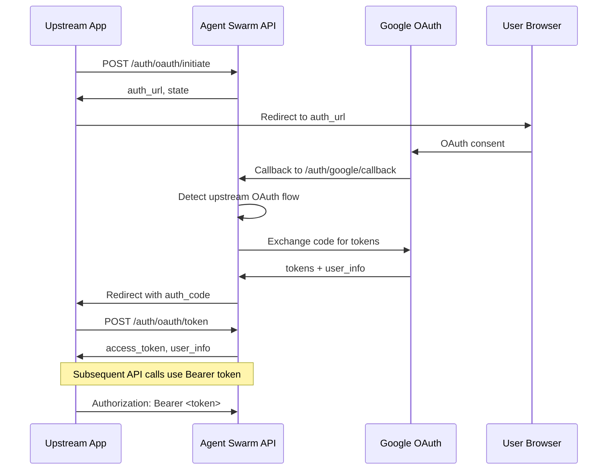

# OAuth API Server Integration Guide

## Overview

Your Agent Swarm server can function as a centralized OAuth provider for upstream applications. This allows you to:

- **Centralize Authentication**: Handle OAuth flows in one place for multiple applications
- **Simplify Integration**: Upstream apps don't need to implement Google OAuth directly
- **Manage User Sessions**: Centralized user and token management
- **Automatic Token Refresh**: Built-in token refresh handling

## Architecture



## API Endpoints

### 1. Initiate OAuth Flow

**Endpoint:** `POST /api/v1/auth/oauth/initiate`

**Purpose:** Start the OAuth flow for an upstream application.

**Request:**

```json
{
  "redirect_uri": "https://your-app.com/oauth-callback",
  "state": "your-csrf-state-value",
  "scopes": [
    "https://www.googleapis.com/auth/userinfo.email",
    "https://www.googleapis.com/auth/userinfo.profile",
    "https://www.googleapis.com/auth/gmail.readonly"
  ]
}
```

**Response:**

```json
{
  "auth_url": "https://accounts.google.com/oauth2/auth?...",
  "state": "your-csrf-state-value",
  "expires_at": "2024-01-01T12:00:00.000Z"
}
```

**Usage:**

```javascript
const response = await fetch('/api/v1/auth/oauth/initiate', {
  method: 'POST',
  headers: {
    'Content-Type': 'application/json',
  },
  body: JSON.stringify({
    redirect_uri: 'https://your-app.com/oauth-callback',
    state: 'csrf-protection-state',
    scopes: ['https://www.googleapis.com/auth/userinfo.email'],
  }),
});

const { auth_url } = await response.json();
// Redirect user to auth_url
window.location.href = auth_url;
```

### 2. OAuth Callback Handler

**Endpoint:** `GET /api/v1/auth/google/callback` (existing Google OAuth callback)

**Purpose:** Internal endpoint that handles Google's OAuth callback and redirects back to your app.

**Flow:**

1. Google redirects to this endpoint with `code` and `state`
2. Agent Swarm detects upstream OAuth flow (state starts with `oauth_state_`)
3. Agent Swarm exchanges code for tokens
4. Agent Swarm stores user data and generates internal auth code
5. Redirects to your app's `redirect_uri` with auth code

**Your callback will receive:**

```
GET https://your-app.com/oauth-callback?code=<auth_code>&state=<your_state>
```

### 3. Exchange Authorization Code for Access Token

**Endpoint:** `POST /api/v1/auth/oauth/token`

**Purpose:** Exchange the authorization code for an access token.

**Request:**

```json
{
  "grant_type": "authorization_code",
  "code": "authorization_code_from_callback"
}
```

**Response:**

```json
{
  "access_token": "session_token_for_api_calls",
  "token_type": "Bearer",
  "expires_in": 3600,
  "refresh_token": "refresh_token_if_available",
  "user_id": "user_uuid",
  "user_info": {
    "email": "user@example.com",
    "name": "John Doe",
    "picture": "https://profile-pic-url"
  }
}
```

**Usage:**

```javascript
const response = await fetch('/api/v1/auth/oauth/token', {
  method: 'POST',
  headers: {
    'Content-Type': 'application/json',
  },
  body: JSON.stringify({
    grant_type: 'authorization_code',
    code: authCodeFromCallback,
  }),
});

const tokenData = await response.json();
// Store tokenData.access_token for API calls
localStorage.setItem('access_token', tokenData.access_token);
```

### 4. Validate Access Token

**Endpoint:** `POST /api/v1/auth/oauth/validate`

**Purpose:** Validate an access token and get user information.

**Request:**

```json
{
  "access_token": "bearer_token_to_validate"
}
```

**Response:**

```json
{
  "valid": true,
  "user_id": "user_uuid",
  "user_info": {
    "email": "user@example.com",
    "name": "John Doe",
    "picture": "https://profile-pic-url"
  },
  "expires_at": "2024-01-01T12:00:00.000Z"
}
```

**Usage:**

```javascript
const response = await fetch('/api/v1/auth/oauth/validate', {
  method: 'POST',
  headers: {
    'Content-Type': 'application/json',
  },
  body: JSON.stringify({
    access_token: storedAccessToken,
  }),
});

const validation = await response.json();
if (!validation.valid) {
  // Token is invalid, redirect to login
  redirectToLogin();
}
```

## Integration Examples

### React Application

```tsx
import React, { useState, useEffect } from 'react';

const AGENT_SWARM_API = 'http://localhost:8900/api/v1';

export function OAuthIntegration() {
  const [user, setUser] = useState(null);
  const [accessToken, setAccessToken] = useState(null);

  // Check for OAuth callback
  useEffect(() => {
    const urlParams = new URLSearchParams(window.location.search);
    const code = urlParams.get('code');
    const state = urlParams.get('state');

    if (code && state) {
      handleOAuthCallback(code, state);
    } else {
      // Check for existing token
      const token = localStorage.getItem('access_token');
      if (token) {
        validateToken(token);
      }
    }
  }, []);

  const startOAuth = async () => {
    try {
      const response = await fetch(`${AGENT_SWARM_API}/auth/oauth/initiate`, {
        method: 'POST',
        headers: {
          'Content-Type': 'application/json',
        },
        body: JSON.stringify({
          redirect_uri: window.location.origin + '/oauth-callback',
          state: 'react-app-state-' + Date.now(),
          scopes: [
            'https://www.googleapis.com/auth/gmail.readonly',
            'https://www.googleapis.com/auth/userinfo.email',
            'https://www.googleapis.com/auth/userinfo.profile',
            'https://www.googleapis.com/auth/calendar',
          ],
        }),
      });

      const { auth_url } = await response.json();
      window.location.href = auth_url;
    } catch (error) {
      console.error('OAuth initiation failed:', error);
    }
  };

  const handleOAuthCallback = async (code, state) => {
    try {
      const response = await fetch(`${AGENT_SWARM_API}/auth/oauth/token`, {
        method: 'POST',
        headers: {
          'Content-Type': 'application/json',
        },
        body: JSON.stringify({
          grant_type: 'authorization_code',
          code: code,
        }),
      });

      const tokenData = await response.json();

      localStorage.setItem('access_token', tokenData.access_token);
      setAccessToken(tokenData.access_token);
      setUser(tokenData.user_info);

      // Clean up URL
      window.history.replaceState({}, document.title, window.location.pathname);
    } catch (error) {
      console.error('Token exchange failed:', error);
    }
  };

  const validateToken = async token => {
    try {
      const response = await fetch(`${AGENT_SWARM_API}/auth/oauth/validate`, {
        method: 'POST',
        headers: {
          'Content-Type': 'application/json',
        },
        body: JSON.stringify({
          access_token: token,
        }),
      });

      const validation = await response.json();

      if (validation.valid) {
        setAccessToken(token);
        setUser(validation.user_info);
      } else {
        localStorage.removeItem('access_token');
      }
    } catch (error) {
      console.error('Token validation failed:', error);
      localStorage.removeItem('access_token');
    }
  };

  const logout = () => {
    localStorage.removeItem('access_token');
    setAccessToken(null);
    setUser(null);
  };

  const makeAuthenticatedRequest = async endpoint => {
    try {
      const response = await fetch(`${AGENT_SWARM_API}${endpoint}`, {
        headers: {
          Authorization: `Bearer ${accessToken}`,
        },
      });

      if (response.status === 401) {
        // Token expired, redirect to login
        logout();
        return;
      }

      return await response.json();
    } catch (error) {
      console.error('Authenticated request failed:', error);
    }
  };

  if (!user) {
    return (
      <div>
        <h2>Login Required</h2>
        <button onClick={startOAuth}>Sign in with Agent Swarm</button>
      </div>
    );
  }

  return (
    <div>
      <h2>Welcome, {user.name}!</h2>
      <p>Email: {user.email}</p>
      <button onClick={() => makeAuthenticatedRequest('/auth/me')}>
        Test Authenticated Request
      </button>
      <button onClick={logout}>Logout</button>
    </div>
  );
}
```

### Node.js/Express Backend

```javascript
const express = require('express');
const fetch = require('node-fetch');

const app = express();
const AGENT_SWARM_API = 'http://localhost:8900/api/v1';

app.use(express.json());

// Middleware to validate tokens
const validateToken = async (req, res, next) => {
  const authHeader = req.headers.authorization;

  if (!authHeader || !authHeader.startsWith('Bearer ')) {
    return res.status(401).json({ error: 'Authorization header required' });
  }

  const token = authHeader.substring(7);

  try {
    const response = await fetch(`${AGENT_SWARM_API}/auth/oauth/validate`, {
      method: 'POST',
      headers: {
        'Content-Type': 'application/json',
      },
      body: JSON.stringify({
        access_token: token,
      }),
    });

    const validation = await response.json();

    if (!validation.valid) {
      return res.status(401).json({ error: 'Invalid token' });
    }

    req.user = validation.user_info;
    req.userId = validation.user_id;
    next();
  } catch (error) {
    console.error('Token validation error:', error);
    res.status(500).json({ error: 'Token validation failed' });
  }
};

// Protected route
app.get('/api/profile', validateToken, (req, res) => {
  res.json({
    message: 'This is a protected route',
    user: req.user,
    userId: req.userId,
  });
});

// Proxy authenticated requests to Agent Swarm
app.use('/api/agent-swarm/*', validateToken, async (req, res) => {
  const targetPath = req.path.replace('/api/agent-swarm', '');

  try {
    const response = await fetch(`${AGENT_SWARM_API}${targetPath}`, {
      method: req.method,
      headers: {
        ...req.headers,
        Authorization: `Bearer ${req.headers.authorization.substring(7)}`,
      },
      body: req.method !== 'GET' ? JSON.stringify(req.body) : undefined,
    });

    const data = await response.json();
    res.status(response.status).json(data);
  } catch (error) {
    console.error('Proxy request failed:', error);
    res.status(500).json({ error: 'Proxy request failed' });
  }
});

app.listen(3001, () => {
  console.log('Backend server running on port 3001');
});
```

## Security Considerations

### 1. State Parameter

Always use a unique, unpredictable state parameter to prevent CSRF attacks:

```javascript
const state = crypto.randomBytes(32).toString('hex');
```

### 2. Redirect URI Validation

The Agent Swarm server should validate redirect URIs against a whitelist:

```typescript
// In production, implement redirect URI validation
const allowedRedirectUris = [
  'https://your-app.com/oauth-callback',
  'http://localhost:4000/oauth-demo.html', // Demo script
  'http://localhost:3000/oauth-callback', // Development only
];

if (!allowedRedirectUris.includes(redirect_uri)) {
  throw new Error('Invalid redirect URI');
}
```

### 3. Token Storage

- **Frontend**: Use secure storage (not localStorage for sensitive apps)
- **Backend**: Store tokens securely with encryption
- **Mobile**: Use keychain/keystore for token storage

### 4. Token Refresh

Implement automatic token refresh:

```javascript
const refreshToken = async refreshToken => {
  const response = await fetch(`${AGENT_SWARM_API}/auth/oauth/token`, {
    method: 'POST',
    headers: {
      'Content-Type': 'application/json',
    },
    body: JSON.stringify({
      grant_type: 'refresh_token',
      refresh_token: refreshToken,
    }),
  });

  return await response.json();
};
```

## Production Deployment

### Environment Variables

```bash
# Agent Swarm Server
GOOGLE_CLIENT_ID=your_google_client_id
GOOGLE_CLIENT_SECRET=your_google_client_secret
GOOGLE_REDIRECT_URI=https://your-api.com/api/v1/auth/google/callback
```

### Redis for Token Storage

Replace in-memory storage with Redis for production:

```typescript
import Redis from 'ioredis';

const redis = new Redis(process.env.REDIS_URL);

export const storeOAuthState = async (
  stateKey: string,
  oauthState: OAuthState
): Promise<void> => {
  await redis.setex(
    `oauth_state:${stateKey}`,
    600, // 10 minutes
    JSON.stringify(oauthState)
  );
};

export const getOAuthState = async (
  stateKey: string
): Promise<OAuthState | null> => {
  const data = await redis.get(`oauth_state:${stateKey}`);
  return data ? JSON.parse(data) : null;
};
```

### Rate Limiting

Implement rate limiting for OAuth endpoints:

```typescript
import rateLimit from 'express-rate-limit';

const oauthLimiter = rateLimit({
  windowMs: 15 * 60 * 1000, // 15 minutes
  max: 10, // Limit each IP to 10 requests per windowMs
  message: 'Too many OAuth requests, please try again later.',
});

app.use('/api/v1/auth/oauth/', oauthLimiter);
```

## Demo Script

The repository includes a complete demo script (`script/oauth-flow-demo.sh`) that demonstrates the entire OAuth flow:

```bash
# Run the demo
./script/oauth-flow-demo.sh

# The demo will:
# 1. Start a local test server (port 4000)
# 2. Initiate OAuth flow with Agent Swarm API
# 3. Open Google OAuth consent screen in browser
# 4. Handle the callback and token exchange automatically
# 5. Display all OAuth flow results in a web interface
```

**What the demo shows:**

- Complete OAuth initiation request
- Automatic code-to-token exchange
- Token validation
- User information display
- Example of making authenticated API calls

**Expected Flow:**

1. Demo calls `POST /api/v1/auth/oauth/initiate`
2. Browser opens Google OAuth consent screen
3. User completes Google OAuth consent
4. Google redirects to `/api/v1/auth/google/callback` (existing callback)
5. Agent Swarm detects upstream OAuth flow (state starts with `oauth_state_`)
6. Agent Swarm processes OAuth and redirects to demo server with auth code
7. Demo server receives authorization code and exchanges it for access token
8. Demo validates the token and displays results

## Testing

### Unit Tests

```typescript
describe('OAuth API', () => {
  test('should initiate OAuth flow', async () => {
    const response = await request(app)
      .post('/api/v1/auth/oauth/initiate')
      .send({
        redirect_uri: 'http://localhost:3000/callback',
        state: 'test-state',
      });

    expect(response.status).toBe(200);
    expect(response.body).toHaveProperty('auth_url');
    expect(response.body).toHaveProperty('state', 'test-state');
  });

  test('should validate tokens', async () => {
    const token = 'valid-test-token';

    const response = await request(app)
      .post('/api/v1/auth/oauth/validate')
      .send({
        access_token: token,
      });

    expect(response.status).toBe(200);
    expect(response.body).toHaveProperty('valid', true);
  });
});
```

### Integration Tests

Create end-to-end tests that simulate the full OAuth flow with a test Google account.

## Troubleshooting

### Common Issues

1. **Invalid redirect URI**: Ensure redirect URIs are exact matches
2. **State mismatch**: Check CSRF state parameter handling
3. **Token expiration**: Implement proper token refresh logic
4. **CORS issues**: Configure CORS for cross-origin requests

### Debug Mode

Enable debug logging:

```typescript
logger.debug('OAuth initiation request:', {
  redirect_uri,
  state,
  scopes,
});
```

## Summary

Your Agent Swarm server now provides a complete OAuth API that upstream applications can use for authentication. This approach:

- ✅ Centralizes OAuth logic
- ✅ Simplifies upstream app development
- ✅ Provides secure token management
- ✅ Supports multiple applications
- ✅ Handles token refresh automatically

The OAuth API endpoints provide a clean, RESTful interface that follows OAuth 2.0 standards while abstracting away the complexity of Google OAuth integration.
