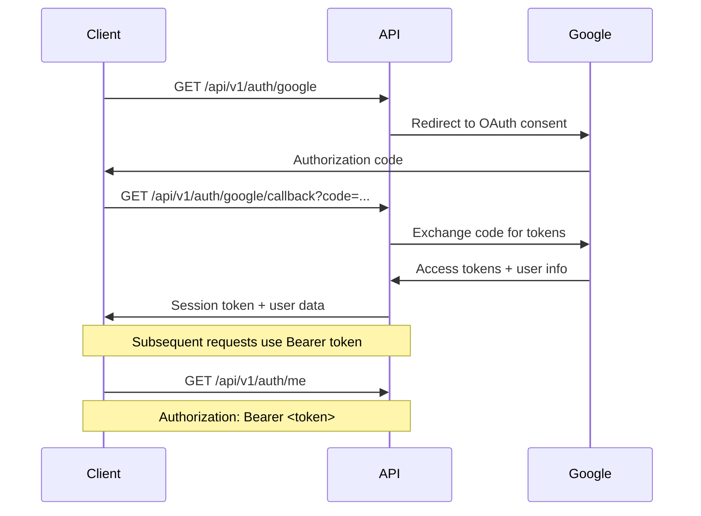

# Agent Swarm API Routes

This directory contains the modular routing structure for the Agent Swarm API, following OpenAPI standards with proper versioning.

## Architecture

### API Versioning

- **Current Version**: `v1`
- **Base Path**: `/api/v1`
- **Legacy Support**: Non-versioned routes are maintained for backward compatibility

### Route Structure

```
src/api/
├── index.ts          # Main router with API versioning
├── auth.ts           # Authentication routes
├── chat.ts           # Chat/conversation routes
├── health.ts         # Health check routes
└── README.md         # This documentation
```

## Authentication System

### Google OAuth 2.0 Flow

1. **Initiate Auth**: `GET /api/v1/auth/google`

   - Redirects to Google OAuth consent screen
   - Uses PKCE-free flow for compatibility

2. **Handle Callback**: `GET /api/v1/auth/google/callback`

   - Processes authorization code
   - Exchanges for access tokens
   - Returns session token and user info

3. **Get User Info**: `GET /api/v1/auth/me`

   - Requires Bearer token
   - Returns authenticated user information

4. **Logout**: `POST /api/v1/auth/logout`
   - Requires Bearer token
   - Invalidates session token

### Authentication Flow



### Session Management

- **Token Type**: Session-based (32-byte random hex)
- **Storage**: In-memory Map (replace with Redis/Database in production)
- **Expiration**: No automatic expiration (implement as needed)
- **Security**: CSRF protection via state parameter

### Security Features

- **CORS**: Configurable origin restrictions
- **State Parameter**: CSRF protection during OAuth flow
- **Bearer Token**: Secure API authentication
- **Error Handling**: Structured error responses with codes

## Chat System

### Session Management

- **Create Session**: `POST /api/v1/chat/session`
- **Get History**: `GET /api/v1/chat/{sessionId}/history`
- **Clear History**: `DELETE /api/v1/chat/{sessionId}/history`

### Message Handling

- **Streaming**: `POST /api/v1/chat/{sessionId}/stream` (Server-Sent Events)
- **Standard**: `POST /api/v1/chat/{sessionId}` (Complete response)

## Health Checks

- **Endpoint**: `GET /api/v1/health`
- **Response**: System status, MCP tools info, timestamps

## Environment Configuration

Create a `.env` file with:

```env
# Server
PORT=3000
NODE_ENV=development
CORS_ORIGIN=*

# Anthropic AI
ANTHROPIC_API_KEY=your_anthropic_api_key

# Google OAuth
GOOGLE_CLIENT_ID=your_google_client_id
GOOGLE_CLIENT_SECRET=your_google_client_secret
GOOGLE_REDIRECT_URI=http://localhost:3000/api/v1/auth/google/callback

# JWT (future use)
JWT_SECRET=your_secret_key
JWT_EXPIRES_IN=24h
```

## Migration from Legacy Auth

The old authentication system in `src/auth/index.ts` is deprecated. Migrate to:

- **Old**: `/auth/google` → **New**: `/api/v1/auth/google`
- **Old**: `/auth/callback` → **New**: `/api/v1/auth/google/callback`
- **New**: `/api/v1/auth/me` (user info endpoint)
- **New**: `/api/v1/auth/logout` (logout endpoint)

## Future Enhancements

### Database Integration

- Replace in-memory session storage
- Implement user management
- Add refresh token support

### Enhanced Security

- JWT token implementation
- Rate limiting middleware
- API key authentication option

### Additional Auth Providers

- GitHub OAuth
- Microsoft OAuth
- SAML integration

### API Documentation

- Swagger/OpenAPI spec generation
- Interactive API documentation
- Postman collection export

## Error Handling

All endpoints return structured errors:

```json
{
  "error": "Error type",
  "message": "Human readable message",
  "code": "ERROR_CODE"
}
```

Common error codes:

- `AUTH_REQUIRED`: Authentication needed
- `INVALID_TOKEN`: Token expired/invalid
- `INVALID_STATE`: CSRF check failed
- `MISSING_CODE`: OAuth code missing
- `INTERNAL_ERROR`: Server error
