# Agent System

A flexible, configuration-driven agent system that supports dynamic agent creation, routing, and management through a centralized registry.

## Architecture Overview

The agent system consists of several key components:

- **Configuration Layer** (`@/shared/config/agents.ts`): Declarative agent definitions for the entire system.
- **Controller** (`@/features/agents/agent.controller.ts`): Manages swarm instances, caching, and logging.
- **Service Layer** (`@/features/agents/agent.service.ts`): Contains factory functions for creating different types of agents.
- **Factory** (`@/features/agents/agent.factory.ts`): A singleton factory for creating the core `AgentRegistry`.
- **Repository/Registry** (`@/features/agents/agent.repository.ts`): Manages agent lifecycle, tool creation, and handovers based on the configuration.
- **DTOs** (`@/features/agents/agent.dto.ts`): Data Transfer Objects and type definitions for the agent system.
- **Agent Utilities** (`@/features/agents/agent.util.ts`): Utility functions for converting MCP tools for agent use.
- **Shared Utilities** (`@/shared/utils/agent.ts`): System-wide utilities for configuration validation and generation.

## Agent Swarm Flow Diagram

The following diagram illustrates how the AgentSwarm library works from the LLM's perspective, showing the actual architecture with Hive, Swarm, Queen Agent, and tool execution flow:

```mermaid
graph TB
    subgraph "Session Level"
        User[👤 User Request] --> API[🌐 API Endpoint]
        API --> SwarmCache{🗄️ Swarm Cache<br/>by Session ID}
    end
    
    subgraph "Hive Factory Pattern"
        SwarmCache -->|Cache Miss| HiveCreation[🏭 ExtendedHive Creation]
        HiveCreation --> Queen[👑 Queen Agent<br/>Business Logic Agent]
        Queen --> Registry[📋 Agent Registry]
        Registry --> ConfiguredAgents[⚙️ Configured Agents<br/>restaurant, google, etc.]
        HiveCreation --> SpawnSwarm[🐝 hive.spawnSwarm]
        SpawnSwarm --> SwarmInstance[🏢 ExtendedSwarm Instance]
        SwarmCache -->|Cache Hit| SwarmInstance
    end
    
    subgraph "Swarm Execution Flow"
        SwarmInstance --> StreamText[📡 swarm.streamText]
        StreamText --> ActiveAgent{🎯 Active Agent<br/>Initially: Queen}
        
        ActiveAgent --> LLMCall[🤖 LLM Generation<br/>generateText/streamText]
        LLMCall --> SystemPrompt[📝 Agent Instructions<br/>agent.getInstructions]
        LLMCall --> WrappedTools[🛠️ Wrapped Tools<br/>wrapTools]
        
        WrappedTools --> FunctionTools[⚡ Function Tools<br/>MCP Server Tools]
        WrappedTools --> HandoverTools[🔄 Handover Tools<br/>transfer_to_*]
    end
    
    subgraph "LLM Decision & Tool Execution"
        LLMCall --> LLMDecision{🧠 LLM Decision<br/>Which tool to call?}
        
        LLMDecision -->|Function Tool| ExecuteFunction[⚡ Execute Function Tool<br/>MCP Server Call]
        LLMDecision -->|Handover Tool| ExecuteHandover[🔄 Execute Handover Tool<br/>Agent Switch]
        LLMDecision -->|No Tool| GenerateText[💬 Generate Text Response]
        
        ExecuteFunction --> ToolResult[📊 Tool Result]
        ToolResult --> ContinueLoop{🔄 Continue Loop?<br/>maxTurns check}
        
        ExecuteHandover --> AgentSwitch[🔀 Agent Switch]
        AgentSwitch --> UpdateActiveAgent[🎯 Update _activeAgent]
        AgentSwitch --> UpdateContext[🗂️ Update Context]
        AgentSwitch --> NewAgentTools[🛠️ New Agent Tools<br/>Different MCP + Handovers]
        UpdateActiveAgent --> ContinueLoop
        
        GenerateText --> StreamResponse[📡 Stream Response]
        ContinueLoop -->|Yes| LLMCall
        ContinueLoop -->|No| StreamResponse
    end
    
    subgraph "Response Handling"
        StreamResponse --> TextStream[📝 Text Stream<br/>result.textStream]
        StreamResponse --> FullStream[🔄 Full Stream<br/>result.fullStream]
        StreamResponse --> Messages[💬 Messages<br/>result.messages]
        
        TextStream --> UserResponse[👤 User Response]
        Messages --> MessageHistory[📚 Message History]
        
        FullStream --> ToolCallInfo[🔧 Tool Call Information]
        ToolCallInfo --> Logging[📊 Logging & Monitoring]
    end
    
    subgraph "Agent Types & Tools"
        Queen --> ReceptionistTools[📞 Handover Tools Only<br/>transfer_to_restaurant<br/>transfer_to_google<br/>transfer_to_*]
        
        ConfiguredAgents --> RestaurantAgent[🍽️ Restaurant Agent]
        RestaurantAgent --> RestaurantTools[🛠️ restaurant-booking tools<br/>🛠️ time tools<br/>📞 handover tools]
        
        ConfiguredAgents --> GoogleAgent[🔍 Google Agent]  
        GoogleAgent --> GoogleTools[🛠️ google-assistant tools<br/>📞 handover tools]
        
        ConfiguredAgents --> OtherAgents[⚙️ Other Specialized Agents]
        OtherAgents --> OtherTools[🛠️ Domain-specific MCP tools<br/>📞 handover tools]
    end
    
    style Queen fill:#e1f5fe
    style RestaurantAgent fill:#f3e5f5
    style GoogleAgent fill:#e8f5e8
    style SwarmInstance fill:#fff3e0
    style LLMCall fill:#ffebee
    style ActiveAgent fill:#e8f5e8
    style ExecuteHandover fill:#fff3e0
    style AgentSwitch fill:#f3e5f5
```



### How AgentSwarm Actually Works - LLM Perspective

#### 1. **Hive Factory Pattern**
- **ExtendedHive**: Factory that creates swarm instances with a configured Queen agent
- **Queen Agent**: The "receptionist" that starts with only handover tools
- **Swarm Cache**: Each user session gets a persistent swarm instance

#### 2. **Swarm Execution Loop**
```typescript
// Actual agentswarm flow
const swarm = hive.spawnSwarm();
const result = swarm.streamText({ messages: history });

// Internal loop in swarm.streamText():
do {
  // 1. LLM sees current agent's tools (wrapped)
  const llmResult = await streamText({
    model: this._activeAgent.config.model || this.defaultModel,
    system: this._activeAgent.getInstructions(this.context),
    tools: this.wrapTools(this._activeAgent.tools), // Key: tools are wrapped
    messages: [...initialMessages, ...responseMessages]
  });
  
  // 2. Check tool calls
  const handoverCalls = unhandledToolCalls.filter(
    toolCall => this._activeAgent.tools?.[toolCall.toolName].type === 'handover'
  );
  
  // 3. Execute handover if found
  if (handoverCalls.length > 0) {
    const result = await handoverTool.execute(args, {});
    this._activeAgent = result.agent; // Switch agent
    if (result.context) this.context = {...this.context, ...result.context};
  }
} while (responseMessages.length < maxTotalSteps);
```

#### 3. **Tool Wrapping Mechanism**
The library automatically wraps tools to:
- **Hide Context**: `swarmContext` parameter is injected, not seen by LLM
- **Handle Handovers**: Handover tools have no executor, stopping generation for manual handling
- **Function Tools**: MCP tools execute normally and can update context

#### 4. **Agent Switching Flow**
1. **LLM calls handover tool** (e.g., `transfer_to_restaurant`)
2. **Swarm detects handover** (no executor, type: 'handover')
3. **Execute handover function** with LLM args + current context
4. **Switch active agent** (`this._activeAgent = result.agent`)
5. **Update context** if handover returns context changes
6. **Continue loop** with new agent's tools and instructions

#### 5. **Key Technical Details**

**Tool Availability per Agent:**
- **Queen Agent**: Only handover tools (transfer_to_*)
- **Specialized Agents**: MCP tools + handover tools (including transfer_back_to_receptionist)

**Context Management:**
- **Persistent**: Context maintained across agent switches
- **Updatable**: Both function tools and handover tools can update context
- **Hidden**: Context automatically injected into tool calls, invisible to LLM

**Streaming:**
- **Text Stream**: Pure text output for user display
- **Full Stream**: Includes tool calls, handovers, agent switches
- **Messages**: Complete conversation history with tool results

**Agent Lifecycle:**
- **Queen**: Always the starting agent (receptionist role)
- **Active Agent**: Changes based on handover tool execution
- **Return to Queen**: Optional behavior after task completion

This architecture ensures the LLM only sees relevant tools for its current role while maintaining seamless handovers and context preservation across the entire conversation.

## Agent Handover Mechanism - Detailed Flow

The following diagram shows the step-by-step process of how AgentSwarm handles agent transfers and tool discovery from the LLM's perspective:

```mermaid
%%{init: {
  'theme': 'base',
  'themeVariables': {
    'primaryColor': '#ffffff',
    'primaryTextColor': '#000000',
    'primaryBorderColor': '#000000',
    'lineColor': '#000000',
    'secondaryColor': '#f8f9fa',
    'tertiaryColor': '#ffffff',
    'background': '#ffffff',
    'mainBkg': '#ffffff',
    'secondBkg': '#f8f9fa',
    'tertiaryBkg': '#ffffff'
  }
}}%%
sequenceDiagram
    participant User
    participant Swarm as ExtendedSwarm
    participant LLM as Language Model
    participant Queen as Queen Agent (Receptionist)
    participant Restaurant as Restaurant Agent
    participant MCP as MCP Servers
    
    Note over User,MCP: Example: "Find me a romantic restaurant for dinner tonight"
    
    User->>Swarm: User Message
    Swarm->>Swarm: Set activeAgent = Queen
    
    rect rgb(240, 248, 255)
        Note over Swarm,Queen: Phase 1: Queen Agent Processing
        Swarm->>Queen: getInstructions(context)
        Queen-->>Swarm: "You are a receptionist that routes queries..."
        
        Swarm->>Queen: Get agent.tools
        Queen-->>Swarm: { transfer_to_restaurant: {type: "handover"}, transfer_to_google: {type: "handover"} }
        
        Swarm->>Swarm: wrapTools(queen.tools)
        Note over Swarm: Handover tools have NO executor<br/>Function tools have executor
        
        Swarm->>LLM: streamText({<br/>  system: "You are a receptionist...",<br/>  tools: { transfer_to_restaurant, transfer_to_google },<br/>  messages: [...history, userMessage]<br/>})
        
        Note over LLM: LLM sees only handover tools<br/>Available: transfer_to_restaurant, transfer_to_google
        
        LLM->>LLM: Analyze: "romantic restaurant" → need restaurant agent
        LLM-->>Swarm: Tool Call: transfer_to_restaurant({query: "romantic restaurant dinner"})
    end
    
    rect rgb(248, 255, 248)
        Note over Swarm,Restaurant: Phase 2: Handover Detection & Execution
        Swarm->>Swarm: Detect handover call (no executor)
        Note over Swarm: unhandledToolCalls.filter(<br/>  call => agent.tools[call.toolName].type === 'handover'<br/>)
        
        Swarm->>Swarm: Execute handover tool manually
        Note over Swarm: const result = await handoverTool.execute({<br/>  ...llmArgs, ...context<br/>})
        
        Swarm->>Swarm: Switch active agent
        Note over Swarm: this._activeAgent = result.agent<br/>this.context = {...context, ...result.context}
        
        Swarm->>Swarm: Add handover result to stream
        Note over Swarm: Stream: "Handing over to Restaurant Agent"
    end
    
    rect rgb(255, 248, 240)
        Note over Swarm,Restaurant: Phase 3: Restaurant Agent Processing
        Swarm->>Restaurant: getInstructions(context)
        Restaurant-->>Swarm: "You are a restaurant recommendation specialist..."
        
        Swarm->>Restaurant: Get agent.tools
        Restaurant-->>Swarm: {<br/>  search_restaurants: {type: "function"},<br/>  book_restaurant: {type: "function"},<br/>  get_current_time: {type: "function"},<br/>  transfer_back_to_receptionist: {type: "handover"},<br/>  transfer_to_google: {type: "handover"}<br/>}
        
        Swarm->>Swarm: wrapTools(restaurant.tools)
        Note over Swarm: Function tools get executor<br/>Handover tools have no executor
        
        Swarm->>LLM: streamText({<br/>  system: "You are a restaurant specialist...",<br/>  tools: { search_restaurants, book_restaurant, get_current_time, transfer_back_to_receptionist, transfer_to_google },<br/>  messages: [...history, handoverResult]<br/>})
        
        Note over LLM: LLM now sees DIFFERENT tools!<br/>Available: restaurant tools + handover tools
        
        LLM->>LLM: Analyze: Need to search for restaurants
        LLM-->>Swarm: Tool Call: search_restaurants({location: "nearby", cuisine: "romantic"})
    end
    
    rect rgb(255, 240, 248)
        Note over Swarm,MCP: Phase 4: Function Tool Execution
        Swarm->>Swarm: Detect function call (has executor)
        Swarm->>MCP: Execute restaurant search
        MCP-->>Swarm: Restaurant results
        Swarm->>Swarm: Update context if needed
        Swarm->>LLM: Tool result + continue generation
        
        LLM->>LLM: Process results, generate response
        LLM-->>User: "I found several romantic restaurants:<br/>1. Candlelight Bistro - French cuisine..."
    end
    
    Note over User,MCP: Key: LLM discovers new tools through agent switching<br/>Each agent switch = new tool set + new instructions
```



### Step-by-Step Handover Process

#### **Phase 1: Initial Agent (Queen/Receptionist)**
```typescript
// Queen agent only has handover tools
queen.tools = {
  transfer_to_restaurant: { type: 'handover', execute: async (args) => ({ agent: restaurantAgent }) },
  transfer_to_google: { type: 'handover', execute: async (args) => ({ agent: googleAgent }) }
}

// LLM sees wrapped tools (handover tools have no executor)
const wrappedTools = {
  transfer_to_restaurant: tool({ description: "...", parameters: schema }), // NO execute function
  transfer_to_google: tool({ description: "...", parameters: schema })      // NO execute function
}
```

#### **Phase 2: Handover Detection**
```typescript
// In swarm.streamText() loop:
const toolCalls = await llmResult.toolCalls;
const toolResults = await llmResult.toolResults;

// Find calls without results (handovers have no executor)
const unhandledToolCalls = toolCalls.filter(
  call => !toolResults.some(result => result.toolCallId === call.toolCallId)
);

// Identify handover calls
const handoverCalls = unhandledToolCalls.filter(
  call => this._activeAgent.tools[call.toolName].type === 'handover'
);

if (handoverCalls.length > 0) {
  // Execute handover manually
  const handoverTool = this._activeAgent.tools[handoverCalls[0].toolName];
  const result = await handoverTool.execute({
    ...handoverCalls[0].args,  // LLM-generated args
    ...this.context            // Current swarm context
  });
  
  // Switch agent
  this._activeAgent = result.agent;
  if (result.context) this.context = {...this.context, ...result.context};
}
```

#### **Phase 3: New Agent Tools Discovery**
```typescript
// Restaurant agent has different tools
restaurantAgent.tools = {
  search_restaurants: { 
    type: 'function', 
    execute: async (args) => ({ result: await mcpCall('search', args) })
  },
  book_restaurant: { 
    type: 'function', 
    execute: async (args) => ({ result: await mcpCall('book', args) })
  },
  transfer_back_to_receptionist: { 
    type: 'handover', 
    execute: async (args) => ({ agent: queenAgent })
  }
}

// Next LLM call sees completely different tools
const newLLMCall = streamText({
  system: restaurantAgent.getInstructions(context), // New instructions!
  tools: wrapTools(restaurantAgent.tools),          // New tools!
  messages: [...history, handoverMessage]
});
```

#### **Phase 4: Tool Execution Flow**
```typescript
// Function tools execute immediately
if (toolCall.toolName === 'search_restaurants') {
  const tool = this._activeAgent.tools['search_restaurants'];
  const result = await tool.execute({
    ...toolCall.args,
    ...this.context  // Context injected automatically
  });
  
  // Result goes back to LLM for continued generation
  return result;
}
```

### Key Insights: How LLM Knows About Tool Changes

1. **No Direct Notification**: LLM doesn't "know" about the handover - it just makes a tool call
2. **Execution Loop**: Swarm detects handover, switches agent, then continues the loop
3. **New Generation Call**: Next `streamText()` call uses new agent's tools and instructions
4. **Tool Discovery**: LLM discovers new tools through the new function calling interface
5. **Context Preservation**: Previous conversation context is maintained across switches

### Technical Implementation Details

**Handover Tool Characteristics:**
- `type: 'handover'` (vs `type: 'function'`)
- No executor in wrapped tool (causes LLM generation to stop)
- Manual execution by swarm after detection

**Function Tool Characteristics:**
- `type: 'function'` (default)
- Has executor in wrapped tool (executes automatically)
- Can update swarm context through return value

**Agent Switch Process:**
1. LLM calls handover tool → Generation stops (no executor)
2. Swarm detects handover → Executes handover function manually
3. Swarm switches `_activeAgent` → New tools and instructions
4. Swarm continues loop → New `streamText()` call with new agent
5. LLM sees new tools → Continues with domain-specific capabilities

This seamless handover mechanism allows the LLM to work with different specialized tool sets without being aware of the underlying agent switching infrastructure.

## Key Features

✅ **Declarative Configuration**: Define agents in JSON-like configuration  
✅ **Automatic Validation**: Validates configurations against available MCP servers  
✅ **Dynamic Routing**: Auto-generated handover tools based on configuration  
✅ **Bidirectional Handovers**: Agents can transfer back to receptionist  
✅ **Extensible**: Easy to add new agents without code changes  
✅ **Type Safety**: Full TypeScript support with proper typing  
✅ **Comprehensive Logging**: Detailed logging for debugging and monitoring, managed by the `AgentController`.

## Configuration

### Agent Configuration Schema

```typescript
interface AgentConfig {
  id: string; // Unique identifier
  name: string; // Human-readable name
  description: string; // Agent description
  mcpServers: string[]; // MCP servers this agent uses
  systemPromptFile: string; // Prompt file name (without .txt)
  additionalInstructions?: string; // Extra instructions appended to prompt
  enabled?: boolean; // Whether agent is active (default: true)
  requiresAuth?: boolean; // Whether agent needs authentication
  routingKeywords?: string[]; // Keywords for routing decisions
  routingDescription?: string; // Description for handover tool
}
```

### Example Configuration (`@/shared/config/agents.ts`)

```typescript
export const agentSystemConfig: AgentSystemConfig = {
  receptionist: {
    name: 'Receptionist',
    description: 'Routes user queries to appropriate agents',
    instructions: 'You are a helpful receptionist...',
  },
  agents: [
    {
      id: 'recommendation',
      name: 'Restaurant Recommendation Agent',
      description: 'Handles restaurant recommendations and bookings',
      mcpServers: ['restaurant-booking', 'time'],
      systemPromptFile: 'restaurant-recommendation',
      additionalInstructions: '\n\nCRITICAL: STAY COMPLETELY SILENT...',
      enabled: true,
      requiresAuth: false,
      routingKeywords: ['restaurant', 'food', 'dining', 'eat'],
      routingDescription: 'Transfer to restaurant recommendation agent',
    },
    // More agents...
  ],
};
```

## Usage

The agent system is managed by the `AgentController`, which handles the lifecycle of agent swarms.

### Getting a Swarm Instance

The `getOrCreateSwarm` function in `agent.controller.ts` is the primary way to get a swarm. It caches swarms by session ID to maintain state across requests.

```typescript
import { getOrCreateSwarm } from '@/features/agents/agent.controller';
import { getCurrentModelInfo } from '@/shared/config/models';
import { Session } from '@/shared/middleware/auth';
import { createModel } from 'ai';

// Assume you have a session object and a language model
const session: Session = { id: 'some-session-id', accessToken: '...' };
const modelInfo = getCurrentModelInfo();
const model = createModel({ provider: modelInfo.key });

// Get or create a swarm for the session
const swarm = getOrCreateSwarm(session, model);

// Now you can use the swarm to interact with the agents
const response = await swarm.run('Hello, I need a restaurant recommendation.');
```

### How it Works

The `getOrCreateSwarm` function uses `createHiveSwarm` internally, which demonstrates the core setup process:

```typescript
import { LanguageModelV1 } from 'ai';
import { ChatContext, ExtendedHive, ExtendedSwarm } from './agent.dto';
import { createBusinessLogicAgent } from './agent.service';

// Helper function to create and configure the swarm (from agent.controller.ts)
function createHiveSwarm(
  model: LanguageModelV1,
  accessToken?: string
): ExtendedSwarm<ChatContext> {
  const hive = new ExtendedHive<ChatContext>({
    queen: createBusinessLogicAgent(accessToken), // The "receptionist" agent
    defaultModel: model,
    defaultContext: { topic: null },
  });

  return hive.spawnSwarm();
}
```

This setup involves:

1.  **`createBusinessLogicAgent`**: Creates the receptionist agent, which is the "queen" of the swarm. This function is the primary entry point, defined in `agent.service.ts`.
2.  **`ExtendedHive`**: An extension of the base `Hive` from the `agentswarm` library, defined in `agent.dto.ts`.
3.  **`hive.spawnSwarm()`**: Spawns an `ExtendedSwarm` instance, which is ready to handle user requests.

## Adding New Agents

### Step 1: Configure MCP Server

Add your MCP server to `src/shared/config/mcp.ts`:

```typescript
export const mcpServers: McpServerConfig[] = [
  // ... existing servers
  {
    name: 'your-service',
    url: process.env.YOUR_SERVICE_MCP_URL || 'http://localhost:3001/mcp',
    healthUrl:
      process.env.YOUR_SERVICE_MCP_HEALTH_URL || 'http://localhost:3001/health',
    enabled: process.env.YOUR_SERVICE_MCP_ENABLED !== 'false',
    requiresAuth: false,
  },
];
```

### Step 2: Create System Prompt

Create `src/shared/prompts/your-service.txt`:

```
You are a specialized assistant for [your domain] services.

Your primary role is to help users with [specific tasks].
Use the available tools effectively and provide clear explanations.

Available tools allow you to:
- [List tool capabilities]
```

### Step 3: Add Agent Configuration

Update `src/shared/config/agents.ts`:

```typescript
export const agentSystemConfig: AgentSystemConfig = {
  // ... existing config
  agents: [
    // ... existing agents
    {
      id: 'your-service',
      name: 'Your Service Agent',
      description: 'Handles your service related queries',
      mcpServers: ['your-service'],
      systemPromptFile: 'your-service',
      enabled: true,
      requiresAuth: false,
      routingKeywords: ['service', 'help', 'support'],
      routingDescription: 'Transfer to your service agent for specialized help',
    },
  ],
};
```

### Step 4: Test

That's it! The system will automatically:

- Validate the configuration
- Create the agent with MCP tools
- Generate handover tools for routing
- Set up bidirectional transfers

## Utilities

### Configuration Validation

Located in `src/shared/utils/agent.ts`.

```typescript
import { validateAgentSystemConfig } from '@/shared/utils/agent';
import { agentSystemConfig } from '@/shared/config/agents';

const validation = validateAgentSystemConfig(agentSystemConfig);
if (!validation.valid) {
  console.error('Configuration errors:', validation.errors);
}
```

### Agent Template Generation

Located in `src/shared/utils/agent.ts`.

```typescript
import { generateAgentTemplate } from '@/shared/utils/agent';

const newAgent = generateAgentTemplate(
  'weather',
  'Weather Assistant',
  ['weather-api'],
  {
    routingKeywords: ['weather', 'forecast', 'temperature'],
    requiresAuth: false,
  }
);
```

### Finding Agents by Keywords

Located in `src/shared/utils/agent.ts`.

```typescript
import { findAgentsByKeyword } from '@/shared/utils/agent';
import { agentSystemConfig } from '@/shared/config/agents';

const restaurantAgents = findAgentsByKeyword(agentSystemConfig, 'restaurant');
```

## Migration from Legacy Code

The old monolithic `business-logic.ts` file has been refactored into a modular, configuration-driven architecture:

- **Configuration**: `src/shared/config/agents.ts`
- **Controller**: `src/features/agents/agent.controller.ts`
- **Service**: `src/features/agents/agent.service.ts`
- **Factory**: `src/features/agents/agent.factory.ts`
- **Repository**: `src/features/agents/agent.repository.ts`
- **Utilities**: `src/features/agents/agent.util.ts` & `src/shared/utils/agent.ts`

### Before (120+ lines of complex, hardcoded logic)

```typescript
export default function createBusinessLogicAgent(accessToken?: string) {
  // Set access token on tool registry during agent creation
  if (accessToken) {
    toolRegistry.setAccessTokenForAll(accessToken);
  }

  let recommendationAgent;
  let googleAssistantAgent;

  try {
    // ... 50+ lines of agent creation
  } catch (error) {
    // ... error handling
  }

  const transferToRecommendation = {
    // ... 20+ lines of handover tool creation
  };

  // ... more complex logic
  return receptionistAgent;
}
```

### After (Clean, simple, and factory-driven)

The main entry point in `src/features/agents/agent.service.ts`:

```typescript
import { Agent } from 'agentswarm';
import { AgentFactory } from '@/features/agents/agent.factory';
import { ChatContext } from './agent.dto';

/**
 * Creates and configures the business logic agent system using the AgentFactory.
 */
const createBusinessLogicAgent = (accessToken?: string): Agent<ChatContext> => {
  const factory = AgentFactory.getInstance();
  return factory.createBusinessLogicAgent(accessToken);
};

export { createBusinessLogicAgent };
```

## Benefits

🎯 **Maintainability**: Configuration-driven approach makes changes easy  
🔧 **Extensibility**: Add new agents without modifying existing code  
✅ **Reliability**: Comprehensive validation prevents runtime errors  
📊 **Observability**: Rich logging and statistics for monitoring  
🏗️ **Scalability**: Clean architecture supports growth  
🛡️ **Type Safety**: Full TypeScript support prevents bugs

## Debugging

Enable debug logging by setting log level:

```bash
LOG_LEVEL=debug npm run dev
```

This will show detailed information about:

- Agent creation process
- Handover tool generation
- Transfer operations
- Configuration validation

## Performance

The new system is more efficient than the legacy approach:

- **Lazy Loading**: Agents created only when needed
- **Validation**: Fail-fast with clear error messages
- **Caching**: Factory singleton prevents duplicate work
- **Memory**: Better resource management with proper cleanup and swarm caching.

## Testing

```typescript
import { AgentFactory } from '@/features/agents/agent.factory';
import { agentSystemConfig } from '@/shared/config/agents';
import { createBusinessLogicAgent } from '@/features/agents/agent.service';
import { validateAgentSystemConfig } from '@/shared/utils/agent';

describe('Agent System', () => {
  beforeEach(() => {
    AgentFactory.getInstance().reset();
  });

  it('should create agents from configuration', () => {
    const agent = createBusinessLogicAgent();
    expect(agent).toBeDefined();
  });

  it('should validate configuration', () => {
    const validation = validateAgentSystemConfig(agentSystemConfig);
    expect(validation.valid).toBe(true);
  });
});
```
